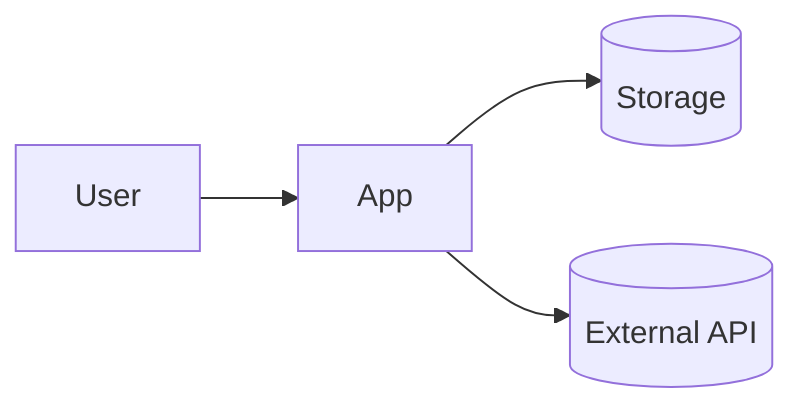

# Technical design & specifications: {project_title}

## 1. Overview
- Context and scope:
- MVP summary:
- Assumptions:
- Out of scope (for now):

## 2. Architecture and components
- System diagram (Mermaid or image, optional):

- Components and responsibilities:
- Trust boundaries / security notes (if any):

## 3. Requirements, constraints & guidelines
Use explicit, numbered items for machine readability.
- REQ-001:
- REQ-002:
- NFR-001:
- SEC-001:
- CON-001:
- GUD-001:
- PAT-001:

## 4. Interfaces & data contracts
Describe APIs/CLIs/data with examples.
- Endpoints/commands:
- Request/response schemas:
```json
{
  "example": "Replace with a minimal, realistic payload"
}
```
- Validation and error formats:

## 5. Data model
- Entities and relationships:
- Persistence/storage approach:
- Data lifecycle & privacy notes:

## 6. Acceptance criteria
Map to requirements where possible.
- AC-001: Given … When … Then … (covers REQ-001)
- AC-002: …
- Demo checklist:
  - [ ] Can demonstrate MVP flow end-to-end
  - [ ] Handles one happy path and one edge case

## 7. Test strategy
- Levels: unit / integration / e2e (pick what’s relevant)
- Frameworks/tools:
- Test data management:
- CI/GitHub Actions (if applicable):
- Coverage or quality bar (right-sized):

## 8. Dependencies & external integrations
List what (not how) is needed.
### External systems
- EXT-001: Name — purpose/integration type
### Third-party services
- SVC-001: Name — required capabilities/SLA (if any)
### Infrastructure/platform
- PLT-001: Platform/runtime — version constraints and rationale
### Data sources
- DAT-001: Source — format/frequency/access
### Compliance/privacy
- COM-001: Requirement — impact (if applicable)

## 9. Non-functional requirements (right-sized)
- Performance targets (if relevant):
- Offline/availability:
- Accessibility (if UI):
- Security/privacy:

## 10. Risks, alternatives, and de-risking steps
- Risk → likelihood/impact → mitigation:
- Alternative considered → rationale:

## 11. Observability & operations (light)
- Logging/metrics (if any):
- Feature flags/toggles (if any):
- Runbooks/usage notes:

## 12. Migration & rollout (if applicable)
- Data or config migration steps:
- Backward compatibility/rollback:

## 13. Decision log
- YYYY-MM-DD: Decision, rationale

## 14. Open questions
- Question → next step:

## 15. Next actions (short)
- [ ] Step 1
- [ ] Step 2
- [ ] Step 3